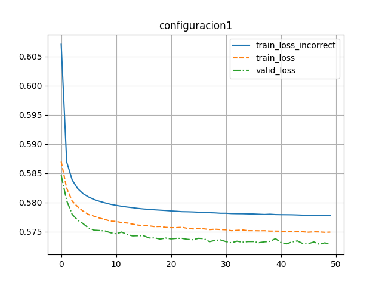

# Configuración 1

```json
{
    "id": 1,
    "learning_rate": 0.001,
    "dropout": 0.2,
    "l_size": 256,
    "batch_size": 100,
    "epochs": 5,
    "lineal": false
}
```



Pérdida de entrenamiento incorrecto: 0.006245979361701757

Pérdida de entrenamiento: 0.007010343703441322

Pérdida de validación: 0.007027081493288278

