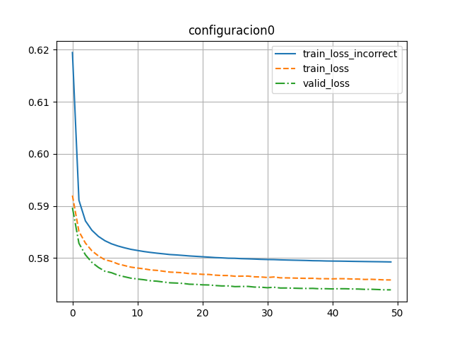

# Configuración 0

```json
{
    "id": 1,
    "learning_rate": 0.001,
    "dropout": 0.2,
    "l_size": 2304,
    "batch_size": 100,
    "epochs": 50,
    "lineal": true
}
```



Pérdida de entrenamiento incorrecto: 0.6816189906001091

Pérdida de entrenamiento: 0.6816189906001091

Pérdida de validación: 0.678600459098816

