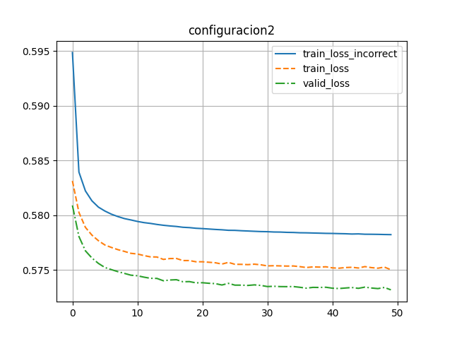
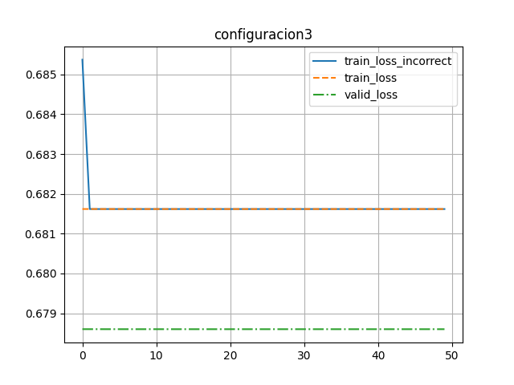
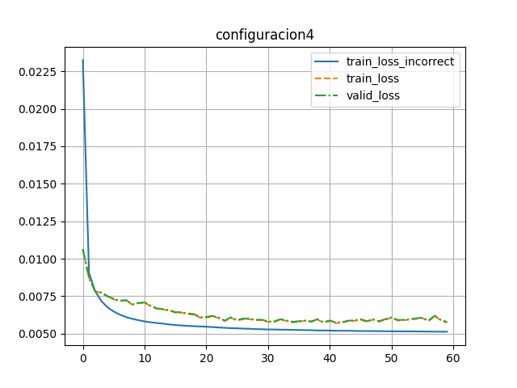
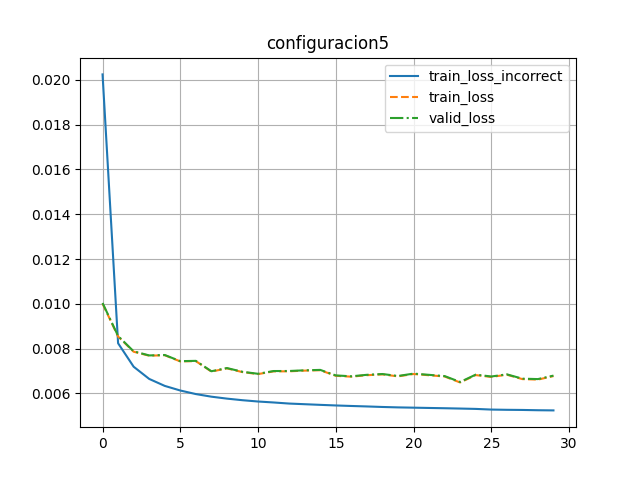

# Configuración 1

```json
{
    "id": 1,
    "learning_rate": 0.001,
    "dropout": 0.2,
    "l_size": 64,
    "batch_size": 100,
    "epochs": 30,
    "lineal": true
}
```


Pérdida de entrenamiento incorrecto: 0.021038790550082922

Pérdida de entrenamiento: 0.02646424128053089

Pérdida de validación: 0.02656679421663284

# Configuración 2

```json
{
    "id": 2,
    "learning_rate": 0.001,
    "dropout": 0.2,
    "l_size": 256,
    "batch_size": 100,
    "epochs": 30,
    "lineal": true
}
```



Pérdida de entrenamiento incorrecto: 0.012825770981920262

Pérdida de entrenamiento: 0.011818529510249694

Pérdida de validación: 0.012096901498734951

# Configuración 3

```json
{
    "id": 3,
    "learning_rate": 0.001,
    "dropout": 0.2,
    "l_size": 512,
    "batch_size": 100,
    "epochs": 30,
    "lineal": true
}
```



Pérdida de entrenamiento incorrecto: 0.010617810577775041

Pérdida de entrenamiento: 0.009333295960289737

Pérdida de validación: 0.009662879910320044

# Configuración 4

```json
{
    "id": 4,
    "learning_rate": 0.001,
    "dropout": 0.2,
    "l_size": 1024,
    "batch_size": 100,
    "epochs": 30,
    "lineal": true
}
```



Pérdida de entrenamiento incorrecto: 0.009367029801942407

Pérdida de entrenamiento: 0.008343576542101801

Pérdida de validación: 0.00869848182424903

# Configuración 5

```json
{
    "id": 5,
    "learning_rate": 0.001,
    "dropout": 0.2,
    "l_size": 128,
    "batch_size": 100,
    "epochs": 30,
    "lineal": false
}
```



Pérdida de entrenamiento incorrecto: 0.005237580896355212

Pérdida de entrenamiento: 0.006770576060904811

Pérdida de validación: 0.0067911753756925465

